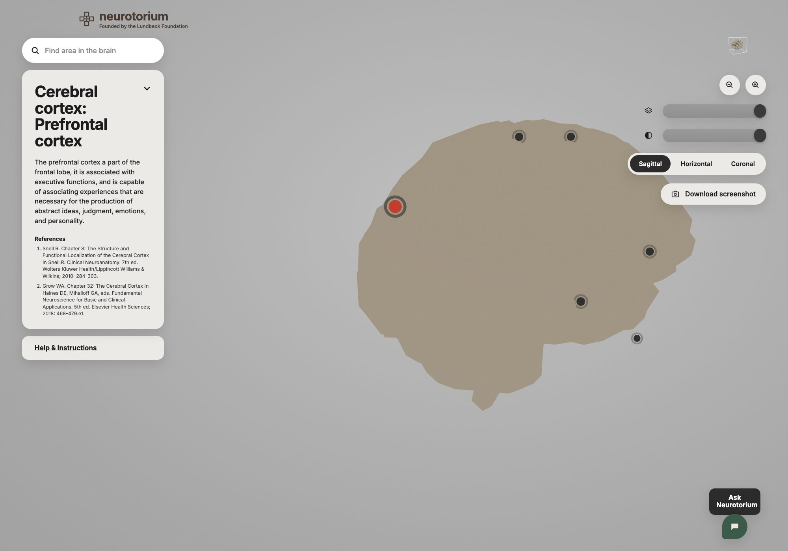

# Brain Atlas — Neurotorium-style replica

An interactive 3D brain atlas built with **Three.js + Vite**, recreating the
design and interaction model of [neurotorium.org's Brain Atlas](https://neurotorium.org/tool/brain-atlas/).



## Features

- **Real 3D brain** — a free, CC0 anatomical brain GLB loaded with `GLTFLoader`,
  re-oriented and studio-lit (RoomEnvironment + directional key/rim) for a
  sculptural look. Falls back to a procedural brain if the model is missing.
- **Clickable regions** — 13 anatomical markers parented to the brain. Click a
  marker (or search) to load its description + references into the info card and
  fly the camera to it.
- **Search** — type to filter brain areas; pick one to jump to it.
- **Cross-sections** — the **Sagittal / Horizontal / Coronal** tabs set a
  clipping-plane axis and snap the camera to that view. The first slider drives
  the cut depth; the second sets brain opacity.
- **Orbit / zoom** — drag to rotate, scroll or use the ⊕ / ⊖ buttons.
- **Orientation gizmo** — a mini wireframe-cube view synced to the main camera.
- **Download screenshot** — saves the current canvas as a PNG.
- **Ask Neurotorium** — a small local assistant that answers from the region data
  and selects the matching region.
- **Deep links** — `#region-id` URLs (e.g. `/#cerebellum`) load straight into a
  region, mirroring Neurotorium's hash routing.

## Run

```bash
npm install            # if the npm cache errors, add: --cache /tmp/npm-cache
npm run dev            # http://localhost:5173
npm run build          # production build into dist/
```

## Structure

```
index.html       layout + all UI chrome (brand, panels, controls)
src/style.css    design system (cards, pills, sliders, grain background)
src/data.js      brain regions: name, description, references, 3D marker position
src/main.js      Three.js scene, model loading, markers, clipping, all interactivity
public/models/brain.glb   CC0 anatomical brain model
```

## Notes / how to extend

- **Swap the brain model:** drop any `brain.glb` into `public/models/`. If its
  native axes differ, adjust `wrap.rotation` in `setupModel()` (this model's
  anterior-posterior axis was native +X, so it's rotated −90° about Y).
- **Region positions** in `src/data.js` use normalized brain coordinates
  (`x` left→right, `y` down→up, `z` back→front) mapped onto the model's bounding
  box, so they survive a model swap with only minor tweaks.
- The model is low-poly (~9k verts); for reference-grade gyri detail, substitute
  a higher-resolution textured brain GLB.
